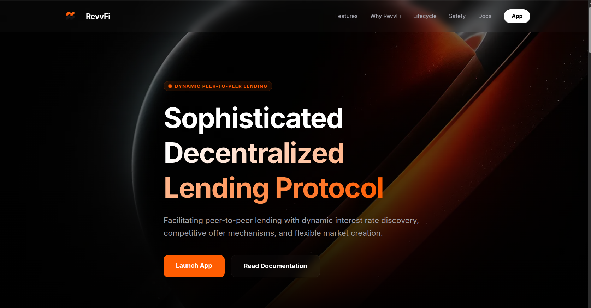

<div align="center">

<br/>


<br/>
<br/>

# revvfi-app

**Landing page for the RevvFi protocol**

<br/>

[](https://opensource.org/licenses/MIT)
[](https://astro.build)
[](https://pages.cloudflare.com)

<br/>

<!-- Add your landing page screenshot here -->


<br/>
<br/>

</div>

---

## Stack

| | |
|---|---|
| Framework | Astro 5 |
| Deployment | Cloudflare Pages |
| Styling | Tailwind CSS |

---

## Getting Started

```bash
git clone https://github.com/RevvFi/revvfi-app.git
cd revvfi-app
npm install
npm run dev
```

---

## Deployment

Deployed automatically to Cloudflare Pages on every push to `main`.

To deploy your own fork, import the repo into [Cloudflare Pages](https://pages.cloudflare.com) and set the build command to `npm run build` with output directory `dist`.

---

## Links

| | |
|---|---|
| Website | [revvfi.xyz](https://revvfi.xyz) |
| Docs | [docs.revvfi.xyz](https://docs.revvfi.xyz) |
| X | [@revvfi_xyz](https://x.com/revvfi_xyz) |
| Discord | [discord.gg/KJ3ttJq5D3](https://discord.gg/KJ3ttJq5D3) |

---

## License

[MIT](./LICENSE) © 2026 RevvFi
